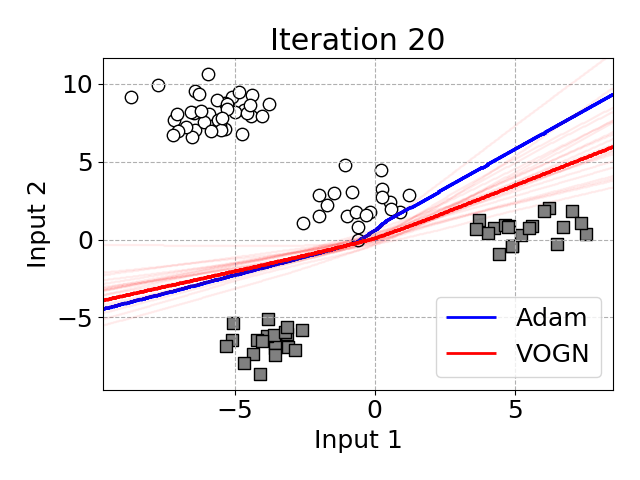
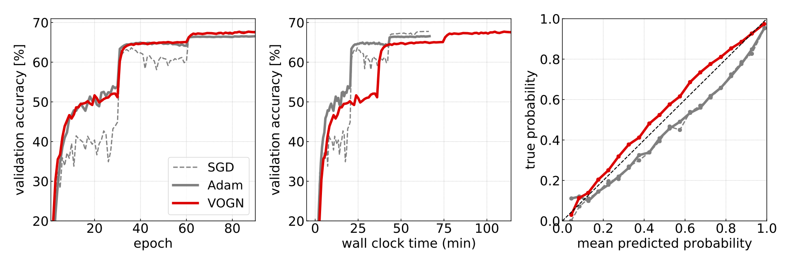

# Practical Deep Learning with Bayesian Principles
This repository aims to provide 
a collection of applications of Bayesian Deep Learning, 
especially the [Natural Gradient for Variational Inference (NGVI)](http://proceedings.mlr.press/v80/khan18a.html).

## Setup
This repository uses [PyTorch-SSO](https://github.com/cybertronai/pytorch-sso), a PyTorch extension for second-order optimization, variational inference, and distributed training.

```bash
$ git clone git@github.com:cybertronai/pytorch-sso.git
$ cd pytorch-sso
$ python setup.py install
```
Please follow the 
[Installation](https://github.com/cybertronai/pytorch-sso#installation) 
of PyTorch-SSO for CUDA/MPI support.


## Uncertainty estimation by NGVI
Decision boundary and entropy plots on 2D-binary classification by MLPs trained 
with Adam and [Variational Online Gauss-Newton (VOGN)](http://proceedings.mlr.press/v80/khan18a.html), a NGVI method with Gauss-Newton approximation of the Hessian.

VOGN optimizes the posterior distribution of each weight (i.e., mean and variance of the Gaussian). 
A model with the mean weights draws the red boundary, and models with the MC samples from the posterior distribution draw light red boundaries.
VOGN converges to a similar solution as Adam while keeping uncertainty in its predictions.

To train MLPs by VOGN and Adam and create GIF
```bash
$ cd toy_example
$ python main.py
```

## NGVI for computer vision
This repository contains code for the NeurIPS 2019 paper "[Practical Deep Learning with Bayesian Principles](https://arxiv.org/abs/1906.02506),"
which includes large-scale results of **NGVI (VOGN) on ImageNet classification**.


VOGN achieves similar performance in about the same number of epochs as Adam and SGD.
Importantly, the benefits of Bayesian principles are preserved: predictive probabilities are well-calibrated (rightmost figure), 
uncertainties on out-of-distribution data are improved (refer the paper),
and continual-learning performance is boosted (refer the paper, an example is to be prepared).  


- Image classification ([MNIST](./classification),
 [CIFAR-10/100](./classification), 
 and [ImageNet](./distributed/classification))
- [WIP] Continual learning for image classification (permuted MNIST)
- [WIP] Per-pixel semantic labeling & segmentation (Cityscapes) 


## Citation
NeurIPS 2019 paper
```
@article{osawa2019practical,
  title = {Practical Deep Learning with Bayesian Principles},
  author = {Osawa, Kazuki and Swaroop, Siddharth and Jain, Anirudh and Eschenhagen, Runa and Turner, Richard E. and Yokota, Rio and Khan, Mohammad Emtiyaz},
  journal = {arXiv preprint arXiv:1906.02506},
  year = {2019}
}
```
